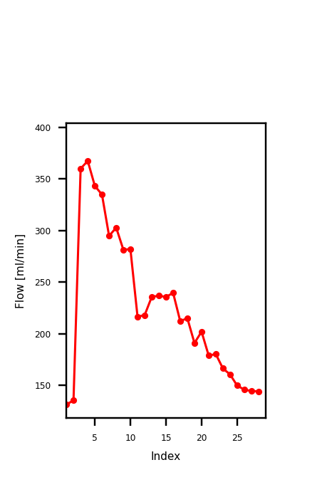

# Test Data

This folder contains example data for testing `PCMCalculator` and verifying that the software is working correctly.

## Input data (`Test/input/`)

Example phase-contrast MRI data in NIfTI format, including velocity (phase), modulus, and magnitude images. These can be loaded directly into `PCMCalculator` using:

```bash
python PCMCalculator.py --img_nii_vel Test/Input/PCMTest_ph.nii --img_nii_mod Test/Input/PCMTest_mod.nii --img_nii_mag Test/Input/PCMTest_mag.nii
```

## Expected output (`Test/Output/`)

The expected results of the analysis are provided in the output folder as a CSV file, containing the flow (ml/min), mean velocity (cm/s), and cross-sectional area (mm²) for each frame. Users can compare their results against these reference values to verify correct installation and function of the software.


```
,Flow,Velocity,CSarea
0,131.14,20.24,10.80
1,135.48,20.91,10.80
2,360.03,34.02,17.64
3,367.51,36.99,16.56'
...
...
...
```
## Example output images



