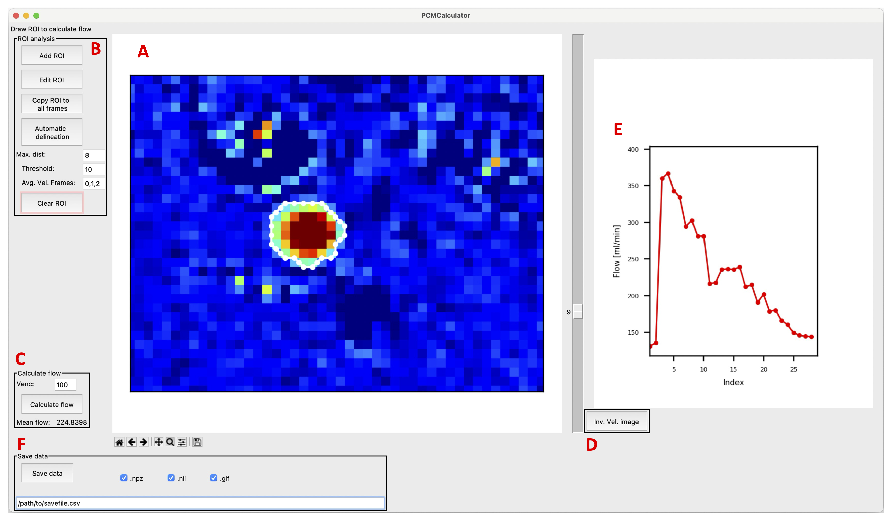

# Summary

`PCMCalculator` (**P**hase **C**ontrast **M**apping Calculator) is a Python-based graphical user interface (GUI) application for analyzing two-dimensional phase-contrast (PC) magnetic resonance imaging (MRI) data to quantify through-plane blood flow. The software enables users to load phase contrast data, visualise velocity and anatomical data, draw regions of interest (ROIs) covering target vessels, and calculate blood flow in quantitative values (ml/min). Additionally, the software includes a pulsatility analysis module for cardiac-gated acquisitions.

Phase-contrast MRI is a widely used and well-established technique for the non-invasive, in vivo assessment of blood flow in vessels, with applications in both research and clinical settings. The PCM method works by encoding blood velocity information into the phase of the MRI signal. By acquiring velocity-encoded phase maps perpendicular to vessels of interest, blood flow can be calculated from the blood velocity and cross-sectional area of the vessel [@Nayler1986; @Bakker1995; @Bakker1996]. However, freely available, lightweight, and easy-to-use software for post-processing of PCM data and calculation of blood flow remains limited, which restricts accessibility for both clinical and research applications.

`PCMCalculator` addresses this gap by providing a dedicated tool for phase-contrast MRI analysis. The software offers an intuitive graphical user interface that enables users to load, visualize, and analyze PCM data and calculate blood flow without any programming expertise. Images can be displayed with adjustable colormaps and intensity ranges to optimize vessel visibility. Region of interests (ROIs) covering the targeted vessels can be defined either through manual polygon delineation or generated semi-automatically using a built-in region-growing algorithm. From these ROIs, blood flow is calculated in quantitative units (ml/min), along with mean velocity (cm/s) and cross-sectional area (mm²). Results can be exported to CSV format for further statistical analysis, and ROI masks can be saved in NIfTI or NumPy archive formats for reproducibility. The software was developed so that personnel without a programming background could use it for their analyses, thus widening its usability across clinical and research settings.

# Statement of Need

Quantitative in vivo measurement of blood flow is a highly valuable tool for studying physiology and pathophysiology, with applications spanning multiple clinical and research domains. Phase-contrast MRI enables non-invasive blood flow quantification in both human subjects and preclinical animal models. For example, phase-contrast MRI is widely used to measure cerebral blood flow (CBF) by quantifying flow in the internal carotid and basilar arteries [@Vestergaard2019; @Ruitenberg2005; @Vernooij2008; @Vestergaard2023a]. Phase-contrast MRI is also extensively used to study cardiac flow and blood flow in the aorta and other large abdominal and thoracic vessels [@Chai2005; @Bertelsen2016; @Rasmussen2025]. The technique has also been validated against perfusion PET imaging [@Vestergaard2017] and has been found to show good reproducibility [@Madsen2023; @Spilt2002]. 

Despite the widespread availability of phase-contrast sequences on practically all MRI scanners, post-processing of phase-contrast data for flow quantification often requires either commercial vendor-specific software packages or custom programming solutions that lack user-friendly interfaces for non-technical personnel. Commercial tools may be expensive and proprietary, while developing custom analysis pipelines requires programming expertise that may not be available in all clinical or research environments. PCMCalculator addresses this gap by providing an open-source, easy-to-use, and lightweight software tool for PCM analysis. The main advantages of PCMCalculator are:

- **Open-source accessibility**: Freely available software
- **Multi-vendor support**: Supports Philips PAR/REC files directly and NIfTI files converted from Siemens or other vendor DICOM data using dcm2niix [@Li2016] and tested on data from multiple different scanners including a 3T Philips dSTREAM Achieva and a 3T Siemens Biograph mMR hybrid PET/MR system
- **User-friendly GUI**: No programming expertise required for routine analysis
- **Flexible ROI tools**: Both manual polygon delineation and semi-automatic region-growing segmentation
- **Pulsatility analysis**: Built-in calculation of the Pulsatility Index and Volume of Arterial Pulsatility (ΔV) for cardiac-gated acquisitions
- **Reproducible outputs**: Standardized CSV export for statistical analysis, with optional ROI export in NIfTI and NumPy formats for full reproducibility

# Implementation

`PCMCalculator` is implemented in Python 3.13 and utilizes established scientific computing libraries including NumPy for numerical operations, NiBabel for handling of medical image formats, Matplotlib for visualization, Tkinter for the graphical interface, pandas for data export, SciPy for numerical integration, and scikit-image for contour extraction in the region-growing algorithm. The software reads Philips PAR/REC files directly via NiBabel's PAR/REC reader or NIfTI files converted from DICOM data using dcm2niix. For NIfTI input, accompanying JSON sidecar files (produced by dcm2niix) are required to identify the image types (velocity, modulus, and phase magnitude).

The GUI is organized into three main panels: a control panel on the left containing buttons for ROI operations and flow calculation, a central image display panel showing the phase-contrast data with ROI overlays, and a right-hand panel displaying the calculated flow from each frame. A slider allows navigation through frames.

The analysis workflow consists of:

1. Loading magnitude and phase (velocity) images from the phase-contrast acquisition in PAR/REC or NIfTI format
2. Adjusting visualization settings including colormap (jet, grayscale, or viridis) and intensity range to optimise vessel visibility
3. If needed, inverting the velocity image to ensure a positive flow direction in the target vessel
4. Defining ROIs around vessels of interest either by manual polygon delineation or by using the semi-automatic region-growing algorithm
5. Copying the ROI to all frames, then editing individual frames as needed to ensure accurate delineation throughout each frame
6. Computing mean velocity and cross-sectional area within each ROI for each frame
7. Calculating flow (velocity × cross-sectional area) and reviewing the flow waveform and mean flow value
8. Optionally performing pulsatility analysis to obtain the Pulsatility Index and ΔV
9. Saving results in CSV format and, optionally, ROIs in NIfTI, NPZ, and/or animated GIF format


# Installation

`PCMCalculator` requires Python 3.13 or later. Download the `PCMCalculator` repository and install the required dependencies:

```bash
pip install -r requirements.txt
```

The required packages are: tkinter (included with standard Python), matplotlib, nibabel, numpy, pandas, scipy, scikit-image, and Pillow.

# Usage

`PCMCalculator` is launched from the command line:

```bash
cd /path/to/PCMCalculator
python PCMCalculator.py
```

When launched without arguments, a file dialog opens for the user to select the input image file. Alternatively, input files can be specified directly via command-line arguments. For Philips PAR/REC files:

```bash
python PCMCalculator.py --img /path/to/file.PAR
```

For NIfTI files (converted from DICOM using dcm2niix), three files corresponding to the velocity (phase), modulus, and magnitude images must be provided:

```bash
python PCMCalculator.py --img_nii_vel velocity.nii --img_nii_mod modulus.nii --img_nii_mag magnitude.nii
```

The software requires three image modalities as input: velocity (phase), modulus, and magnitude images. These are standardly saved when acquiring phase-contrast MRI data. In PAR/REC format, the data is typically saved in a single file. When using the NIfTI format, the three image modalities are typically saved in separate files. The data can contain multiple frames, for example when acquired using cardiac gating, where each frame represents a different time point in the cardiac cycle.

The displayed image type can be switched between velocity, modulus, magnitude, ROI mask, and mean velocity map via the top menu (Image → Change Image Type) or by keyboard shortcuts (Ctrl+1 through Ctrl+5). The colormap can be changed between jet, grayscale, and viridis via the menu (Image → Change Colorbar) or by keyboard shortcuts (Ctrl+Q, Ctrl+W, and Ctrl+E). Colorbar intensity limits can also be manually adjusted. If the data contains multiple frames, these can be navigated using either the arrow keys or the slider. Velocity is displayed in cm/s, as this is the most commonly used unit for phase-contrast MRI data. The ROI mask image shows which voxels are included in the drawn ROI. The mean velocity map displays an average across frames; the frames to be included in this average can be specified in the input box labeled Avg. Vel. Frames.
New data can be loaded via the top menu (File → Load New PAR/REC File or File → Load New NIfTI File).



Figure 1. Demonstration of the interface of the software. (A) The image data is displayed and can be switched between velocity, modulus, magnitude, ROI mask, or mean velocity. An ROI delineating the vessel of interest is drawn to calculate the flow in the vessel. A manual ROI is drawn by selecting **"Add ROI"** in the ROI analysis button group (B). An ROI can be drawn on one frame and copied to all frames. The ROI can be edited on each individual frame to ensure accurate delineation throughout the cardiac cycle. A region-growing algorithm can be used for automatic delineation of the ROI by selecting a seed point in the middle of the vessel. The velocity image can be inverted to ensure a positive flow direction for the target vessel (C). After the ROI has been created, the flow within the ROI can be calculated by pressing **"Calculate Flow"** (D). The mean flow across all frames is shown, and the flow in each frame is plotted in the flow panel (E). (F) The analysis can be saved as a CSV file containing the flow values, mean velocity, and cross-sectional area of the ROI for each frame.

## ROI Delineation

`PCMCalculator` provides two methods for ROI delineation. Manual ROIs are drawn by selecting **"Add ROI"** in the ROI analysis button group, which activates the polygon drawing tool. Polygons are directly drawn on the image using an interactive polygon selector; Polygon vertices are placed by left-clicking on the image. After drawing, the ROI can be toggled between editable and locked states using the **"Edit ROI"** button. A ROI can be drawn on one of the frames and copied to all frames. The ROI can be edited on each specific frame to ensure accurate delineation throughout each frame.
Alternatively, the semi-automatic region-growing algorithm allows users to place a seed point approximately in the center of the vessel, after which the algorithm grows outward to include neighboring voxels whose velocity values exceed a user-defined threshold (default: 10 cm/s). The growth is additionally constrained by a maximum distance from the seed point (default: 8 pixels) to prevent the region from extending beyond the vessel boundary. For multi-frame data, the region-growing algorithm automatically tracks the vessel across all frames by updating the seed position to the voxel with the highest velocity within the current region.

## Flow Calculation
Once ROIs are defined, pressing **"Calculate Flow"** computes the flow for each frame. The calculated flow waveform is displayed in the rightmost panel, along with the mean flow value.
For each frame, the mean velocity within the ROI is calculated from the velocity map. The cross-sectional area of the vessel is determined by multiplying the number of voxels within the ROI by the in-plane voxel area (obtained from the image header). Flow ($Q$) is then computed as:

$$Q = V_{mean} \cdot 60 \cdot A \cdot 0.01$$

where $V_{mean}$ is the mean velocity within the ROI (cm/s) and $A$ is the cross-sectional area (mm²). The result is converted to ml/min, the most commonly used unit for blood flow measurements, by multiplying the velocity by 60 and the cross-sectional area by 0.01. The mean flow across all frames is calculated, and the flow in each frame is plotted in the flow panel.

## Pulsatility Analysis

For cardiac-gated phase-contrast MRI acquisitions, `PCMCalculator` includes a pulsatility analysis module. After flow calculation, users can open the pulsatility analysis window, which displays flow waveforms and calculates two complementary pulsatility measures.

The Pulsatility Index (PI) [@Gosling1974] is calculated as:

$$PI = \frac{Q_{max} - Q_{min}}{Q_{mean}}$$

where $Q_{max}$, $Q_{min}$, and $Q_{mean}$ are the maximum, minimum, and mean flow values across the cardiac cycle, respectively. Higher PI values indicate more pulsatile flow.

The arterial pulsatile volume (ΔV) [@Wahlin2013] quantifies the volume of cyclic arterial distension per heartbeat, which represents the buffering capacity of the downstream arterial tree, and is defined as:

$$\Delta V = \max\left(\int [Q - Q_{mean}] \, dt\right) - \min\left(\int [Q - Q_{mean}] \, dt\right)$$

The pulsatility analysis window displays the flow waveform with horizontal reference lines for $Q_{max}$, $Q_{min}$, and $Q_{mean}$, as well as the cumulative volume integration curve with the ΔV value annotated. The calculation requires the user to input the heart rate to establish the correct temporal resolution.


Figure 2. Demonstration of pulsatility analysis. (A) The maximum ($Q_{max}$), minimum ($Q_{min}$), and mean ($Q_{mean}$) flow rates over the cardiac cycle are identified, from which the pulsatility index is calculated. (B) The cumulative volume integration curve is derived, from which the arterial pulsatile volume (ΔV) is obtained.

## Results Export

Data is saved by providing a save file path and pressing **"Save data"**. The calculated flow from the analysis is saved as a CSV file containing flow (ml/min), mean velocity (cm/s), and cross-sectional area (mm²) of the ROI for each frame. The output filename is automatically generated based on the input filename but can be manually edited before saving.

Optional output formats include:

- **NPZ (NumPy archive)**: Contains the polygon vertices for each ROI, binary ROI masks, and flags indicating which frames have defined ROIs. This format allows complete reproduction of the analysis and reloading of ROIs in subsequent sessions.
- **NIfTI**: ROI masks saved as NIfTI images with the same geometry as the input data, enabling integration with other neuroimaging analysis pipelines.
- **Animated GIF**: PNG images of each frame with the ROI overlay compiled into an animated GIF for visualization and quality control purposes.


# Research Applications
`PCMCalculator` can be used to analyze any kind of 2D phase-contrast MRI data independent of vessel and site, thus offering broad applicability across a wide range of clinical and research contexts. So far, `PCMCalculator` has been used in numerous research projects investigating cerebral blood flow (CBF), and has been used to examine for abnormal cerebral physiology in various patient groups [@Knudsen2024; @Vestergaard2023a; @Lundsgaard2025; @Musaeus2025], to assess cerebral hemodynamic responses to hypoxic exposure [@Vestergaard2022], and to assess cerebrovascular reactivity to breath-hold challenges and acetazolamide administration [@Vestergaard2019; @Vestergaard2023b]. These studies highlight the software's ability to handle a variety of experimental paradigms and physiological challenges, providing blow flow quantification under varying conditions. The software has also been used in conjunction with other perfusion-weighted techniques such as arterial spin labelling (ASL) and water PET imaging, where phase-contrast MRI measurements have served as an independent reference for calibration and quantification purposes [@Vestergaard2022; @Vestergaard2025]. The reproducibility of the software for assessing cerebral blood flow has been investigated in dedicated test-retest studies, supporting its suitability for longitudinal and repeated-measures research designs [@Madsen2023].

Recently, `PCMCalculator` has also been applied to measure blood flow in the large abdominal vessels, including the superior mesenteric artery, celiac trunk, portal vein, hepatic artery, and renal artery [@Rasmussen2025]. Thus, `PCMCalculator` can be used to study gastrointestinal, hepatic, and renal physiology. Beyond blood flow measurements, the software can also be used to quantify cerebrospinal fluid (CSF) flow, for example through the cerebral aqueduct, making it useful for investigations of CSF dynamics. 

`PCMCalculator` can also be used to perform pulsatility analysis of blood flow from cardiac-gated measurements.

`PCMCalculator` provides a freely available, open-source, and easy-to-use software for the analysis of 2D phase-contrast MRI data and quantification of blood flow. By offering an intuitive graphical user interface that requires no programming expertise. The broad range of research applications in which `PCMCalculator` has been successfully employed, demonstrates its versatility and utility across different physiological domains. It is hoped that `PCMCalculator` can serve as a valuable and accessible tool for the wider MRI research and clinical community.

Vestergaard, M.B. (2026). PCMCalculator: A Python GUI for Analyzing 2D Phase Contrast Mapping MRI Data to Measure Blood Flow (v1.0.1). Zenodo. https://doi.org/10.5281/zenodo.18712355 [@Vestergaard2026]
 
# References
